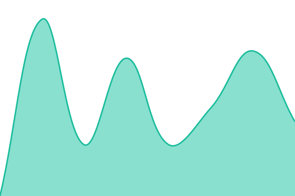
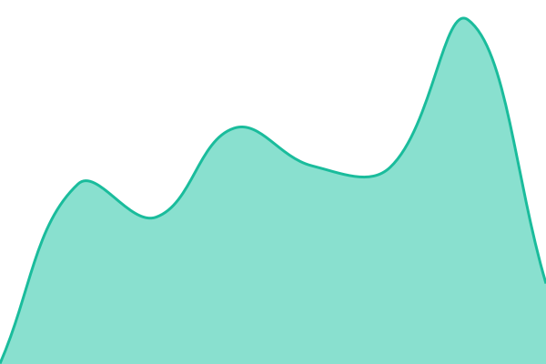
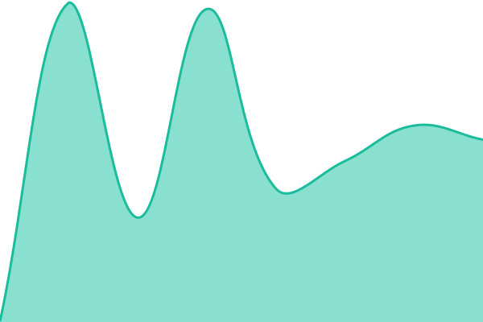
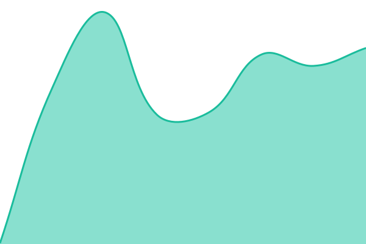
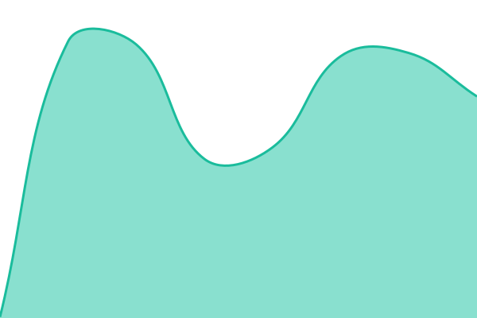
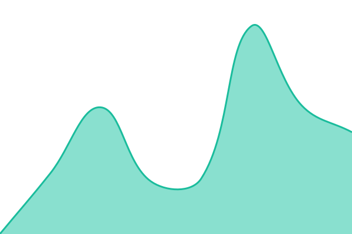
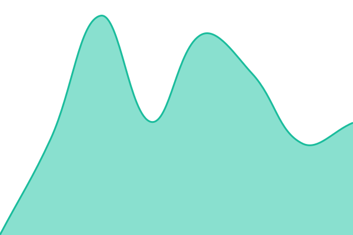
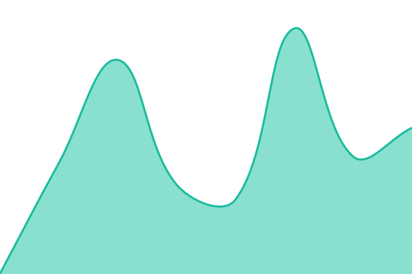

# [📈 Live Status](https://status.webcosa.com): <!--live status--> **🟩 All systems operational**

This repository contains the open-source uptime monitor and status page for [Upptime](https://upptime.js.org), powered by [Upptime](https://github.com/upptime/upptime).

With [Upptime](https://upptime.js.org), you can get your own unlimited and free uptime monitor and status page, powered entirely by a GitHub repository. We use [Issues](https://github.com/upptime/upptime/issues) as incident reports, [Actions](https://github.com/upptime/upptime/actions) as uptime monitors, and [Pages](https://status.webcosa.com) for the status page.

<!--start: status pages-->
<!-- This summary is generated by Upptime (https://github.com/upptime/upptime) -->
<!-- Do not edit this manually, your changes will be overwritten -->
<!-- prettier-ignore -->
| URL | Status | History | Response Time | Uptime |
| --- | ------ | ------- | ------------- | ------ |
|  [Espace client](https://cms.webcosa.com) | 🟩 Up | [espace-client.yml](https://github.com/Webcosa/status-page/commits/HEAD/history/espace-client.yml) | 

 895ms
     
 | 

<a href="https://status.webcosa.com/history/espace-client">100.00%</a>
    

|  [Base de données](https://cms.webcosa.com/api/sante?c=base) | 🟩 Up | [base-de-donnees.yml](https://github.com/Webcosa/status-page/commits/HEAD/history/base-de-donnees.yml) | 

 726ms
     
 | 

<a href="https://status.webcosa.com/history/base-de-donnees">100.00%</a>
    

|  [Connexion](https://cms.webcosa.com/api/sante?c=connexion) | 🟩 Up | [connexion.yml](https://github.com/Webcosa/status-page/commits/HEAD/history/connexion.yml) | 

 723ms
     
 | 

<a href="https://status.webcosa.com/history/connexion">99.62%</a>
    

|  [Rendu des sites](https://cms.webcosa.com/api/sante?c=rendu) | 🟩 Up | [rendu-des-sites.yml](https://github.com/Webcosa/status-page/commits/HEAD/history/rendu-des-sites.yml) | 

 306ms
     
 | 

<a href="https://status.webcosa.com/history/rendu-des-sites">100.00%</a>
    

|  [Sites clients](https://cms.webcosa.com/api/sante?c=site) | 🟩 Up | [sites-clients.yml](https://github.com/Webcosa/status-page/commits/HEAD/history/sites-clients.yml) | 

 248ms
     
 | 

<a href="https://status.webcosa.com/history/sites-clients">100.00%</a>
    

|  [Écran de connexion](https://cms.webcosa.com/api/sante?c=ecran) | 🟩 Up | [ecran-de-connexion.yml](https://github.com/Webcosa/status-page/commits/HEAD/history/ecran-de-connexion.yml) | 

 266ms
     
 | 

<a href="https://status.webcosa.com/history/ecran-de-connexion">100.00%</a>
    

|  [Site vitrine](https://www.webcosa.com) | 🟩 Up | [site-vitrine.yml](https://github.com/Webcosa/status-page/commits/HEAD/history/site-vitrine.yml) | 

 362ms
     
 | 

<a href="https://status.webcosa.com/history/site-vitrine">100.00%</a>
    

|  [Documentation](https://dev.webcosa.com) | 🟩 Up | [documentation.yml](https://github.com/Webcosa/status-page/commits/HEAD/history/documentation.yml) | 

 447ms
     
 | 

<a href="https://status.webcosa.com/history/documentation">100.00%</a>
    

|  [Store](https://store.webcosa.com) | 🟩 Up | [store.yml](https://github.com/Webcosa/status-page/commits/HEAD/history/store.yml) | 

 442ms
     
 | 

<a href="https://status.webcosa.com/history/store">100.00%</a>
    

<!--end: status pages-->

[**Visit our status website →**](https://status.webcosa.com)

## 📄 License

- Powered by: [Upptime](https://github.com/upptime/upptime)
- Code: [MIT](./LICENSE) © [Anand Chowdhary](https://anandchowdhary.com)
- Data in the `./history` directory: [Open Database License](https://opendatacommons.org/licenses/odbl/1-0/)
